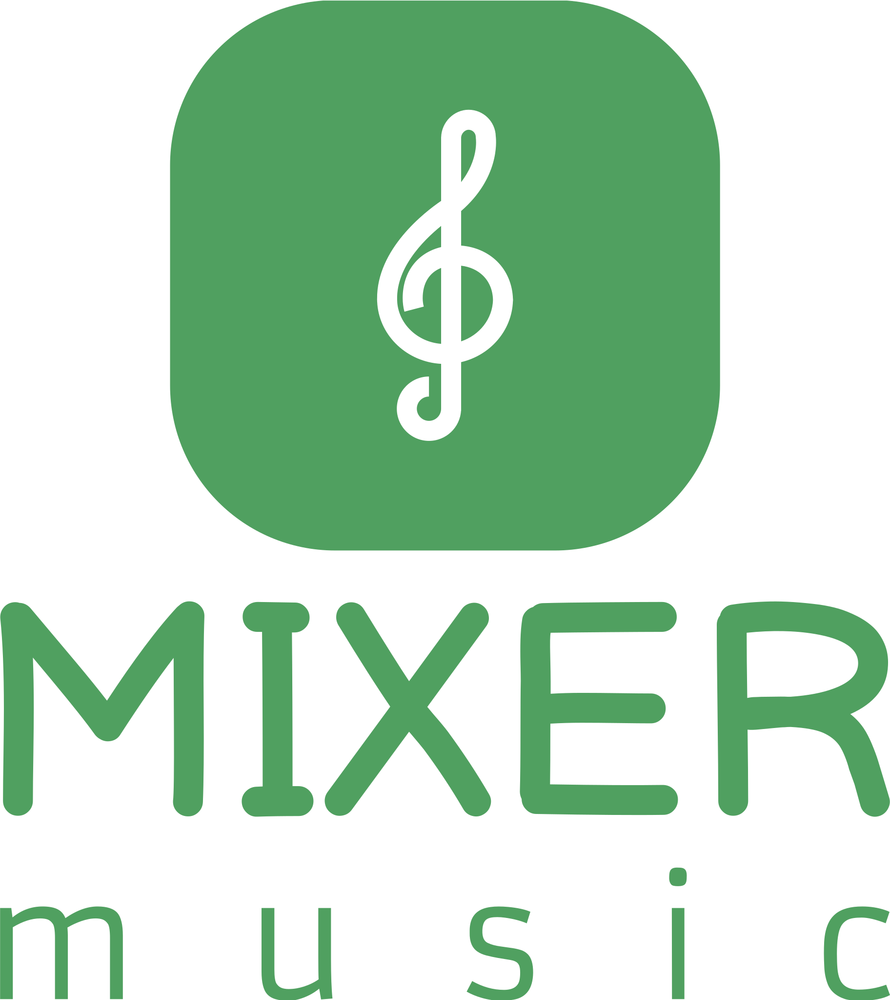

  

  
<h2 align="center">--under development--</h2>   
## spotify clone project:     
For educational purposes ONLY   
  
## Requirements:     
  - Composer "for installing the next requirements"  
  - laravel "obviously the framework the project uses"    
  - breeze "for managing authentication and registeration"    
  - node js  "required for using breeze"   
  - npm  "required for using breeze"   
  - doctrine/dbal "for modifying columns in migrations"   
  - guzzle  "for using APIs"   
  
## log:
  the storage directory inside public MUST be deleted after downloading the project to be able to create the sym link  
  ALL the front-end code is in the directory "resources/views"  
